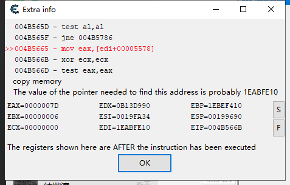

# 植物大战僵尸修改器实验报告


## CE初步体验

1. 此次游戏修改的机理就是改写数据对应的内存中的数值
2. 首先体验一下CE，选择植物大战僵尸进程<br>
3. 游戏中此时的阳光为2225，我们搜索2225<br>
4. 进入游戏，改变阳光，现在是2250<br>
5. 输入2250，点击next scan，表示查看在原来是2225的数据中那些变成了2250,很幸运只有一个，那就是它了<br>
6. 利用CE直接修改阳光，效果如下<br><br>

## 寻找基地址

1. 然而事情并没有这么简单，这里找到的阳光地址每次游戏启动是会更改的，因为是个动态地址，想要写在程序里，我们必须要找到基地址然后主动寻址去找到动态的阳光数量地址,截图如下，可以看到,地址和上次并不一样<br>

2. 通过搜索引擎可以了解到，CE中，如果是基地址，会标为绿色，那么我们的思想就是，查看该动态地址的来源，可能是个多级寻址的过程，需要不断向上寻找，直到找到不变的基地址为止

3. 右键查看谁访问过该地址，可以发现，[edi+5578]表示的就是阳光的值<br>

4. 继续搜索edi的这个数值`1EABFA10`,看看谁访问或者赋值了，可能会很多，我们要不断刷新等待进游戏切出来等等,直到不在改变为止，总之是一个非常考验耐心过程<br>

5. 我们在这里发现了`1EABFA10`赋值情况，将[esi+868]的值，也就是`1EABFA10`赋给了edi，也就是有进行了一次寻址，那我我们接着寻找esi`027AB680`的值何时获得<br>

6. 这里出现了绿色，我们可以判断这是基址，也就是说`027AB680`这个值在基地址，我们在CE中添加一个指针进行验证<br><br>

7. 可以看到，随着游戏的改变，这个经过二次寻址的值也发生着变化，可以判断基地址为0x007794f8,两次寻址的偏移量为0x868和0x5578<br>

8. 流程如下<br>


## 代码

1. 找到了基址，找到了寻址偏移，就能进行内存写入的修改功能了，还可以用类似方法实现其他诸如怪物秒杀，无冷却，改金钱等功能
2. 这里还实现了植物无冷却，由于冷却没有显示具体数值，所以是利用CE数据中的上升数据和下降数据，不断缩小范围找到的，且每个植物块单独在一断内存中，有着各自的属性，代码中我只加入了阳光和植物冷却的修改，但也着实费了不少功夫。
3. 详情代码、数值地址和注释见代码页，由于只涉及到内存的读和写，所以相对行数较少。
4. 以下是个人目前找到的地址含义

```
阳光 基地址+0x868+0x5578
金钱 基地址+0x94c+0x50
僵尸上限 基地址+0x868+ac
植物数量 基地址+0x868+0x15c+24
每个植物内容大小 0x50
植物冷却时间 基地址+0x868+0x15c+0x24
```


